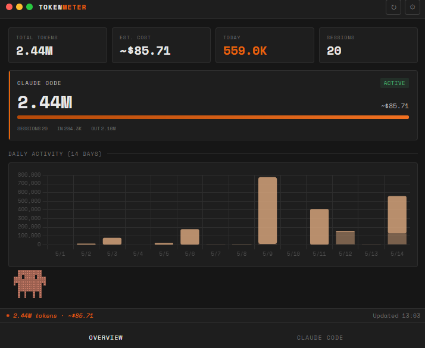
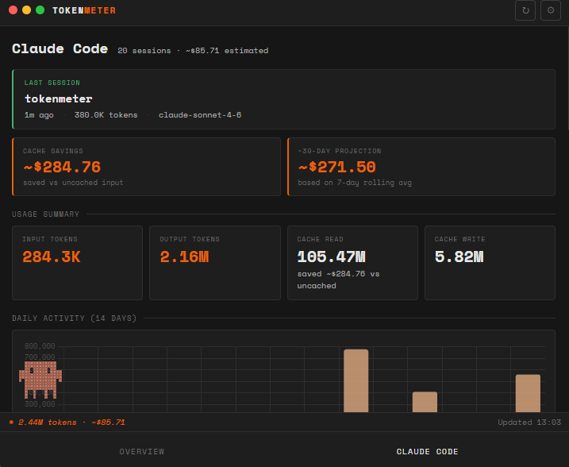
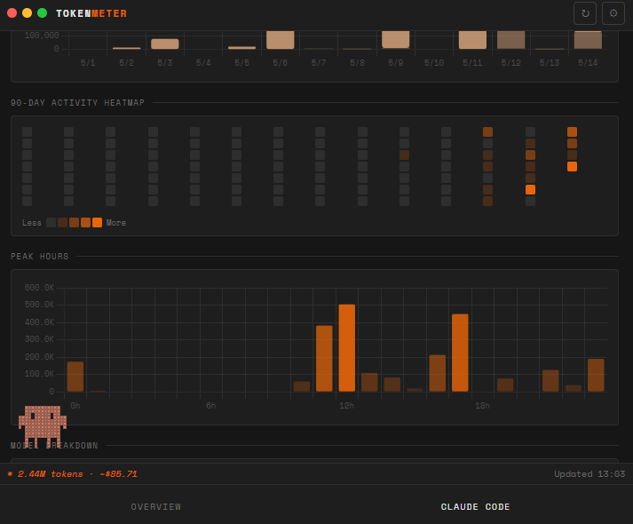

<div align="center">
  
</div>

<br/>

<div align="center">

[](https://github.com/DewashishCodes/tokenmeter/releases/latest)
[](https://github.com/DewashishCodes/tokenmeter/releases/latest)
[](LICENSE)

</div>

<br/>

**Tokenmeter** is a Windows desktop app that reads your local Claude Code session files and gives you a live terminal-style dashboard of token usage, costs, and activity patterns — entirely offline, zero telemetry, no API keys.

<br/>

<div align="center">
  
  
  
</div>

<br/>

## Features

**Usage & Cost**
- Total tokens, estimated cost, today's usage, session count — always at a glance
- Accurate cache savings vs uncached input pricing (per-record, per-model)
- 30-day cost projection based on your 7-day rolling average
- Daily cost alert — native notification when you exceed a threshold

**Activity**
- 14-day daily activity chart with input/output breakdown
- 90-day GitHub-style heatmap of your Claude activity
- Peak hours chart — see which hours you run heaviest
- Per-project sparklines — 14-day mini charts in the breakdown table
- Last active session always pinned at the top

**App**
- System tray — lives in your taskbar, shows today's token count on hover
- 60-second auto-refresh + `Ctrl+R` to refresh manually
- Idle pixel companion with 7 animations: breath, blink, think, dance, wink, surprise, sway
- Dark terminal aesthetic, compact 720×600 window

## Install

Download from [**Releases →**](https://github.com/DewashishCodes/tokenmeter/releases/latest)

| File | Description |
|------|-------------|
| `Tokenmeter Setup 1.0.0.exe` | Installer with wizard — creates Desktop & Start Menu shortcuts |
| `Tokenmeter 1.0.0.exe` | Portable — drop anywhere and run, no install needed |

> **Windows SmartScreen:** on first launch Windows may say "Unknown publisher" — click **More info → Run anyway**. This is normal for unsigned apps.

## Requirements

- Windows 10/11 x64
- [Claude Code](https://claude.ai/code) installed and used at least once

Tokenmeter scans `%USERPROFILE%\.claude\projects\**\*.jsonl` — the same session files Claude Code writes locally. No data ever leaves your machine.

## Build from source

```bash
git clone https://github.com/DewashishCodes/tokenmeter
cd tokenmeter
npm install
npm start             # dev mode
npm run build         # → dist/  (installer + portable)
```

Requires Node.js 18+ and Windows with **Developer Mode** enabled (Settings → System → For developers).

## Pricing estimates

Cost estimates use `pricing.json` bundled with the app — hand-editable if Anthropic updates rates. All figures are displayed as `~$` to make clear they are estimates.

## License

MIT © 2026 Dewashish Lambore
